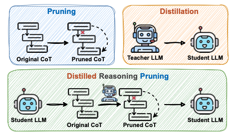
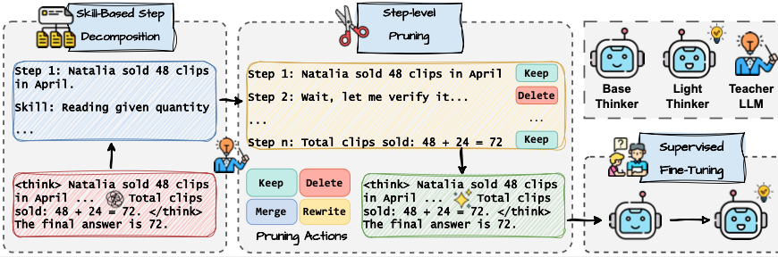

## DRP: Distilled Reasoning Pruning with Skill-aware Step Decomposition for Efficient Large Reasoning Models

This is the official repository of the paper [DRP: Distilled Reasoning Pruning with Skill-aware Step Decomposition for Efficient Large Reasoning Models](https://arxiv.org/abs/2505.13975).

- If you find our work helpful and it has been of any assistance to you, we would greatly appreciate it if you could kindly cite it:
  
```
@misc{jiang2025drpdistilledreasoningpruning,
      title={DRP: Distilled Reasoning Pruning with Skill-aware Step Decomposition for Efficient Large Reasoning Models}, 
      author={Yuxuan Jiang and Dawei Li and Frank Ferraro},
      year={2025},
      eprint={2505.13975},
      archivePrefix={arXiv},
      primaryClass={cs.CL},
      url={https://arxiv.org/abs/2505.13975}, 
}
```

## 🚀 Introduction

While Large Reasoning Models (LRMs) have demonstrated remarkable success in complex reasoning tasks through Long Chain-of-Thought (CoT) reasoning, their inference often involves excessively verbose reasoning traces, resulting in substantial inefficiency. To address this issue, we propose \textbf{Distilled Reasoning Pruning (DRP)}, a hybrid framework that combines inference-time pruning with tuning-based distillation---two widely used strategies for efficient reasoning. DRP employs a teacher model to perform skill-aware step decomposition and content pruning, and then distills the pruned reasoning paths into a student model, enabling it to reason both efficiently and accurately. Across a series of challenging mathematical reasoning datasets, we find models trained with DRP achieve substantial improvements in token efficiency without sacrificing accuracy. Specifically, DRP reduces the average token usage on GSM8K from 917 to 328 while improving accuracy from 91.7% to 94.1%, and achieves a 43% token reduction on AIME with no performance drop. Further analysis reveals that aligning the reasoning structure of training CoTs with the student’s reasoning capacity is critical for effective knowledge transfer and performance gains.

<div style="text-align: center;">
  
</div>

<div style="text-align: center;">
  
</div>

## 📄 Get Started

### 📝 Setup
- Firstly, install the required environment:
```
conda create -n pl python==3.10

conda activate pl

pip install -r requirements.txt

# important package
deepspeed=0.14.4
flash-attn=2.3.6
llamafactory=0.9.2.dev0
transformers=4.48.1
vllm=0.6.1.post1+cu118
```
- Next, get and fill all the required API. In this work, we use [GPT-4o](https://openai.com/index/gpt-4/), [Gemini-1.5-flash](https://ai.google.dev/gemini-api/docs/models/gemini#gemini-1.5-flash) and [LLaMA-3.3-70B](https://www.together.ai/).
  
### 💻 Models

We use [Mistral-7B-v0.1](https://huggingface.co/mistralai/Mistral-7B-v0.1) for our main experiment. Please first get the access of that model.

### 📥 Data

We put all the dataset used in our experiment [here](https://drive.google.com/drive/folders/1fVQzz0gcRhL6OKc_O4AGHnIq-yd-eckX?usp=sharing), You can directly download it and put `data/` under the current folder, including:
- Instruction seed sampled from [UltraFeedback](https://huggingface.co/datasets/openbmb/UltraFeedback) in `data/UltraFeedback_sampled_30000.json` and `data/UltraFeedback_sampled_30000_new.json`
- Synthetic dataset for each experiment, in `data/sft_data`, `data/pairwise_synthesis`, `data/mixed_data`, `data/inherit_data`, `data_human_written`
- MTBench dataset used to analyze the preference of GPT-4 to LLaMA family in `data/mtbench_extracted.json`
- Model output and judgment results. You can directly download it and put `alpacaEval/`, `alpacaEval_result/` and `arenaHard_result/` under `analysis/` and put `model_answer` under `evaluation/Arena_Hard/data/arena-hard-v0.1/`

## ⛳️ Run

To make the analysis convinient, we released all the judgment results in `analysis/alpacaEval_result/` and `analysis/arenaHard_result/`

### Main Experiment

- First run the following command to train the student models:
```
  bash training/train_sft.sh
```
- Then, judging student models in the two benchmark:
```
  # For Arena-Hard
  cd evaluation/Arena_Hard
  bash inference.sh --sft
  bash judge.sh --sft
  # Then move the judgment result to analysis/Arenahard_result/
  python analysis/parse_arenahard.py --sft

  # For AlpacaEval 2.0
  bash analysis/run_alpacaEval.sh --sft
  # Then copy the output generation to evaluation/Alpaca_Eval2/example/
  cd evaluation/Alpaca_Eval2
  bash judge.sh --sft
  # Then check the output leaderboard.csv for the length-controlled win-rate
```

<div style="text-align: center;">
  
</div>

- To get the preference leakage score, you could follow the equation in our paper to calculate

<div style="text-align: center;">
  
</div>

- To analyze GPT-4's bias to LLaMA family, run:
```
  python llama_analysis.py
```

<div style="text-align: center;">
  
</div>


<div style="text-align: center;">
  
</div>

## Acknowledge

- This work borrows and forks the following repositories for training and evaluation: [LLaMA-Factory](https://github.com/hiyouga/LLaMA-Factory/tree/main), [AlpacaEval](https://github.com/tatsu-lab/alpaca_eval), [Arena-Hard](https://github.com/lmarena/arena-hard-auto).
